## Project structure

### Files
```python
/project
    /mymodule                   #  将GMM模型打包成mymodule里的一个对象
        __init__.py             #  包自说明文件
        GMM.py                  #  模型源代码
    multitrial_Hetero.pkl       #  模型重复试验获得的数据(Heteroscedastic)
    MultiTrial_Hetero.py        #  多线程simulation源代码(Heteroscedastic)
    multitrial_Homo.pkl         #  模型重复实验获得的数据(Homoscedastic)
    MultiTrial_Homo.py          #  多线程simulation源代码(Homooscedastic)
    MultiTrial_ouput_process.py #  处理重复试验获得的数据
    SingleTrial_Hetero.py       #  单次实验并作图展示模型(Heteroscedastic)
    SingleTrial_Homo.py         #  单次实验并作图展示模型(Homoscedastic)
    test.py                     #  测试调用运行速度, 用于查找程序低效率的部分
```

### Process procedures
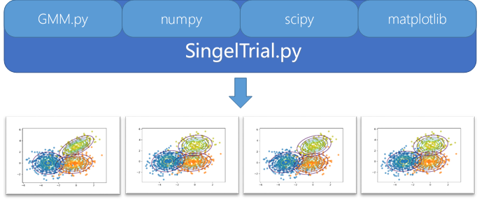
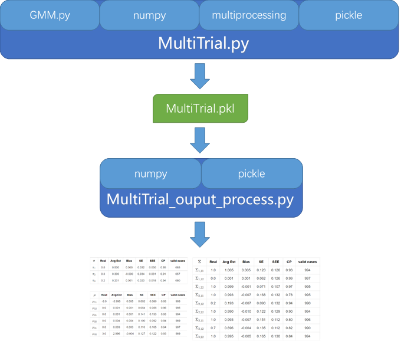


## Single-Trials simulation

### Heteroscedastic Data

#### Parameters
N = 1000

$\pi = (0.5,0.3,0.2)$

$\mu_1 = (-3,0)$ , $\mu_2 = (0,0)$ , $\mu_3 = (0,3)$

$\Sigma_{1} =
\begin{bmatrix}
1 & -0.2\\-0.2 & 1
\end{bmatrix}
$ , $\Sigma_{2} =
\begin{bmatrix}
1 & 0\\0 & 1
\end{bmatrix}
$ , $\Sigma_{3} =
\begin{bmatrix}
1 & 0.7\\0.7 & 1
\end{bmatrix}
$

#### Fit result

Hetero model hetero data
<div style="float:left;border:solid 1px 000;margin:2px;">

</div>
<div style="float:left;border:solid 1px 000;margin:2px;">
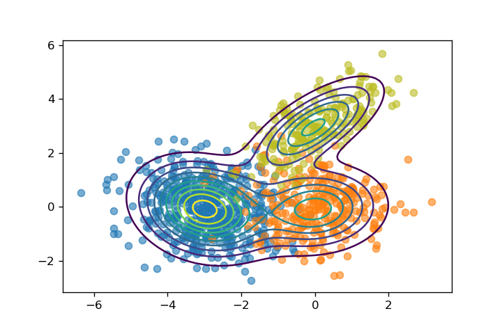
</div>
<div style="float:none;clear:both;">
</div>

Homo model hetero data
<div style="float:left;border:solid 1px 000;margin:2px;">
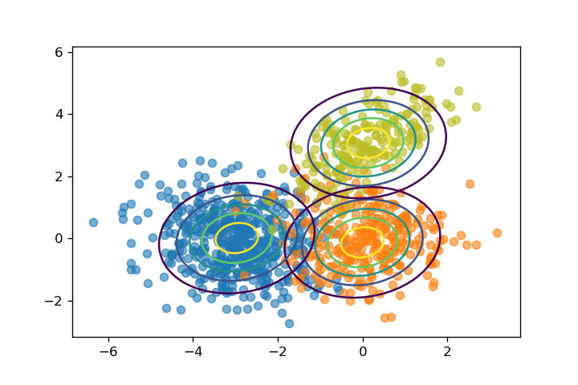
</div>
<div style="float:left;border:solid 1px 000;margin:2px;">
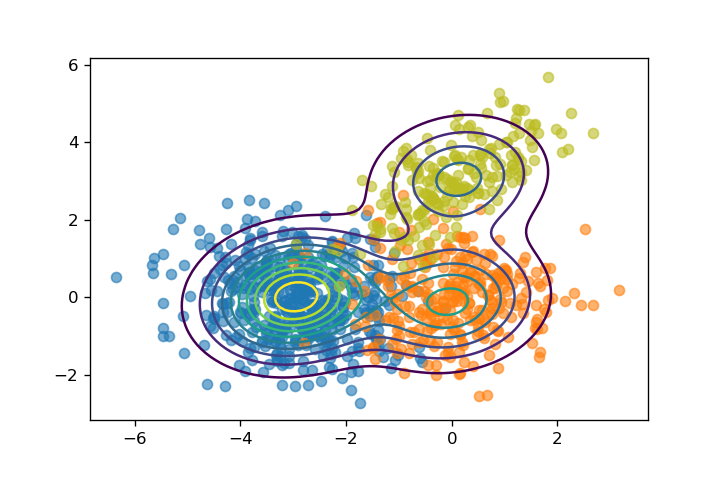
</div>
<div style="float:none;clear:both;">
</div>

Hetero model hetero data, g = 1
<div style="float:left;border:solid 1px 000;margin:2px;">
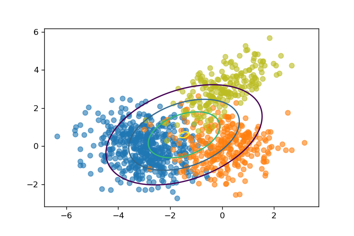
</div>
<div style="float:left;border:solid 1px 000;margin:2px;">
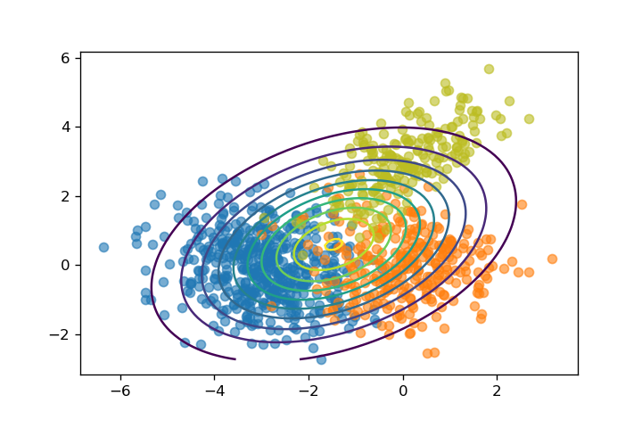
</div>
<div style="float:none;clear:both;">
</div>

Hetero model hetero data, g = 2
<div style="float:left;border:solid 1px 000;margin:2px;">
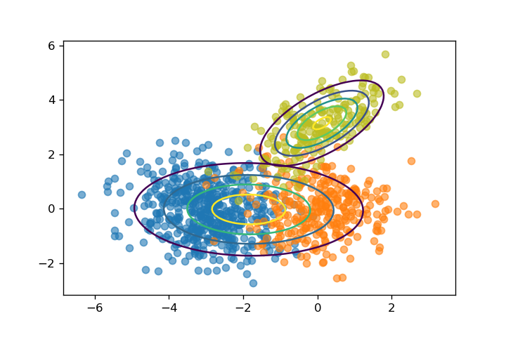
</div>
<div style="float:left;border:solid 1px 000;margin:2px;">
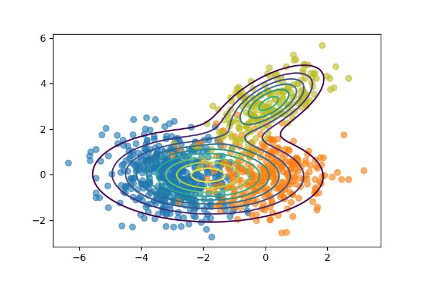
</div>
<div style="float:none;clear:both;">
</div>

Hetero model hetero data, g = 3
<div style="float:left;border:solid 1px 000;margin:2px;">
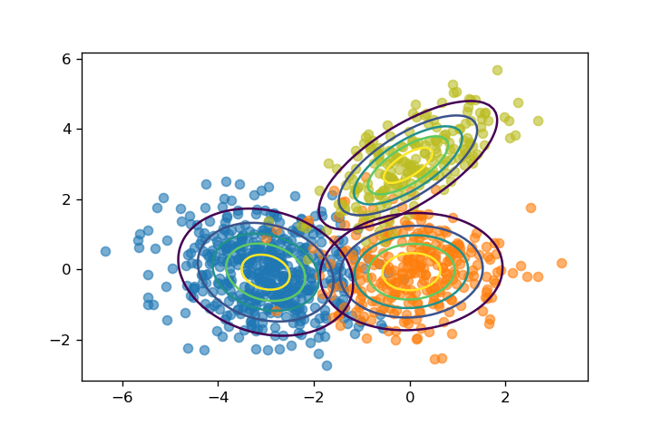
</div>
<div style="float:left;border:solid 1px 000;margin:2px;">

</div>
<div style="float:none;clear:both;">
</div>

Hetero model hetero data, g = 4, case 1
<div style="float:left;border:solid 1px 000;margin:2px;">
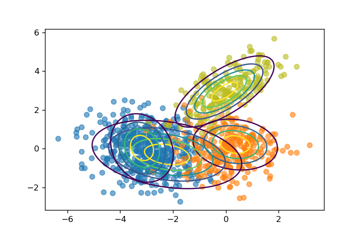
</div>
<div style="float:left;border:solid 1px 000;margin:2px;">
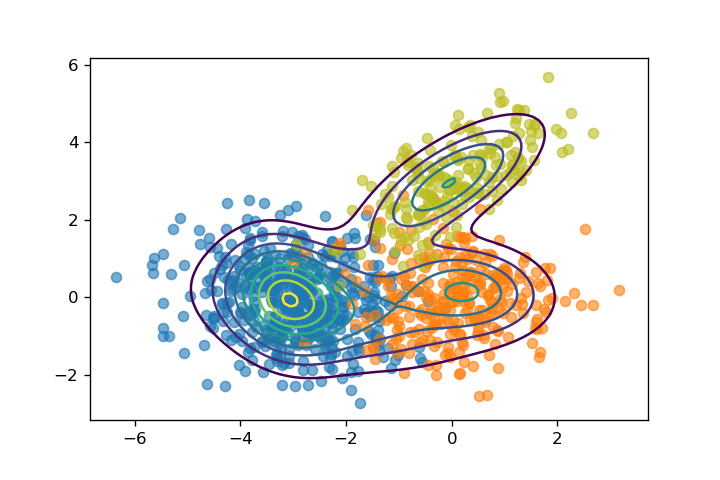
</div>
<div style="float:none;clear:both;">
</div>

Hetero model hetero data, g = 4, case 2
<div style="float:left;border:solid 1px 000;margin:2px;">
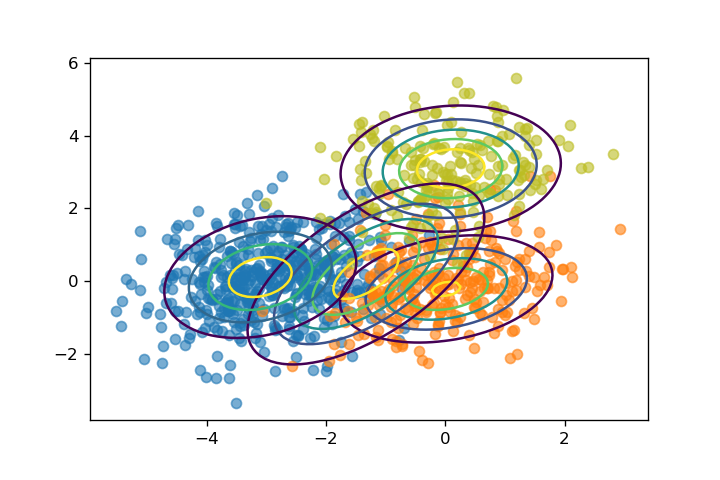
</div>
<div style="float:left;border:solid 1px 000;margin:2px;">

</div>
<div style="float:none;clear:both;">
</div>

### Homoscedastic Data

#### Parameters
N = 1000

$\pi = (0.5,0.3,0.2)$

$\mu_1 = (-3,0)$ , $\mu_2 = (0,0)$ , $\mu_3 = (0,3)$

$\Sigma =
\begin{bmatrix}
1 & 0.2\\0.2 & 1
\end{bmatrix}
$
#### Fit result
<div style="float:left;border:solid 1px 000;margin:2px;">
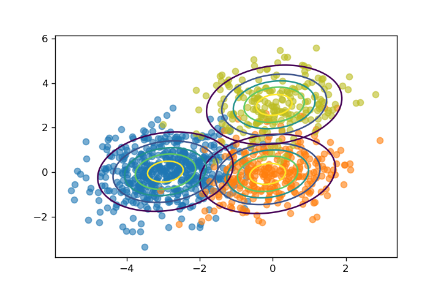
</div>
<div style="float:left;border:solid 1px 000;margin:2px;">
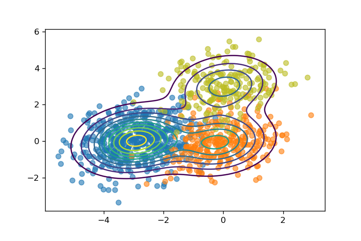
</div>
<div style="float:none;clear:both;">
</div>

<div style="float:left;border:solid 1px 000;margin:2px;">
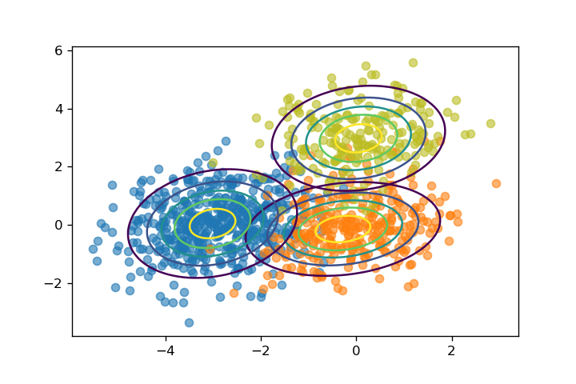
</div>
<div style="float:left;border:solid 1px 000;margin:2px;">
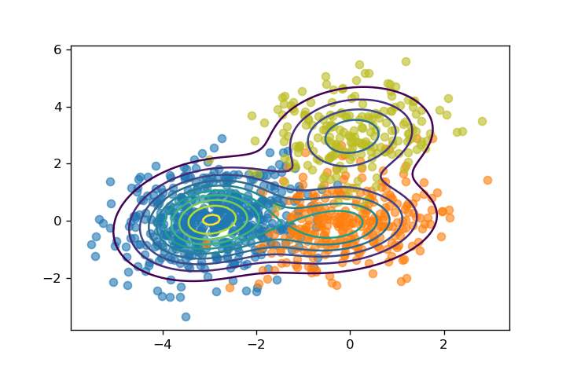
</div>
<div style="float:none;clear:both;">
</div>

## Multi-Trials simulation

### Heteroscedastic

#### Parameters
$\pi = (0.5,0.3,0.2)$

$\mu_1 = (-3,0)$ , $\mu_2 = (0,0)$ , $\mu_3 = (0,3)$

$\Sigma_{1} =
\begin{bmatrix}
1 & -0.2\\0.2 & 1
\end{bmatrix}
$ , $\Sigma_{2} =
\begin{bmatrix}
1 & 0\\0 & 1
\end{bmatrix}
$ , $\Sigma_{3} =
\begin{bmatrix}
1 & 0.7\\0.7 & 1
\end{bmatrix}
$

#### Tables
##### N=1000
| $\pi$           |  Real  |  Avg Est  |   Bias   |    SE   |   SEE   | CP(95%) |  valid cases  |
|-----------------|:------:|:---------:|:--------:|:-------:|:-------:|:-------:|:-------------:|
| $\pi_{1}$       |   0.5  |   0.497   |  -0.003  |  0.030  |  0.029  |   0.94  |      637      |
| $\pi_{2}$       |   0.3  |   0.304   |   0.004  |  0.030  |  0.031  |   0.96  |      613      |
| $\pi_{3}$       |   0.2  |   0.200   |  -0.000  |  0.019  |  0.019  |   0.94  |      666      |

| $\mu$           |  Real  |  Avg Est  |   Bias   |    SE   |   SEE   | CP(95%) |  valid cases  |
| :------         | :----: |  :------: | :------: | :-----: | :-----: |  :----: | :-----------: |
| $\mu_{11}$      |  -3.0  |   -3.010  |  -0.010  |  0.085  |  0.086  |   0.94  |      958      |
| $\mu_{12}$      |   0.0  |   0.005   |   0.005  |  0.052  |  0.053  |   0.96  |      958      |
| $\mu_{21}$      |   0.0  |   -0.014  |  -0.014  |  0.131  |  0.136  |   0.96  |      958      |
| $\mu_{22}$      |   0.0  |   -0.003  |  -0.003  |  0.101  |  0.097  |   0.94  |      958      |
| $\mu_{31}$      |   0.0  |   0.001   |   0.001  |  0.108  |  0.106  |   0.95  |      958      |
| $\mu_{32}$      |   3.0  |   2.995   |  -0.005  |  0.132  |  0.126  |   0.93  |      958      |

| $\Sigma$        |  Real  |  Avg Est  |   Bias   |    SE   |   SEE   | CP(95%) |  valid cases  |
| :--------       | :----: | :-------: |  :-----: |  :----: |  :----: |  :----: | :-----------: |
| $\Sigma_{1,11}$ |   1.0  |   0.986   |  -0.014  |  0.111  |  0.129  |   0.93  |      958      |
| $\Sigma_{1,12}$ |  -0.2  |   -0.195  |   0.005  |  0.060  |  0.129  |   0.99  |      958      |
| $\Sigma_{1,22}$ |   1.0  |   0.998   |  -0.002  |  0.068  |  0.111  |   0.97  |      958      |
| $\Sigma_{2,11}$ |   1.0  |   1.010   |   0.010  |  0.157  |  0.130  |   0.80  |      958      |
| $\Sigma_{2,12}$ |   0.0  |   0.006   |   0.006  |  0.096  |  0.130  |   0.92  |      958      |
| $\Sigma_{2,22}$ |   1.0  |   0.997   |  -0.003  |  0.131  |  0.127  |   0.88  |      958      |
| $\Sigma_{3,11}$ |   1.0  |   0.993   |  -0.007  |  0.146  |  0.111  |   0.80  |      958      |
| $\Sigma_{3,12}$ |   0.7  |   0.696   |  -0.004  |  0.135  |  0.111  |   0.81  |      958      |
| $\Sigma_{3,22}$ |   1.0  |   1.000   |  -0.000  |  0.173  |  0.129  |   0.82  |      958      |

##### N=2000
$\pi,\mu$的结果类似，先看$\Sigma$的情况，可以看到，$\Sigma_2,\Sigma_3$的CP有改进，但仍不算非常好，猜测CP的结果可能跟$\pi_1,\pi_2,\pi_3$的真实值的比例有关系，$\Sigma_1$ 的估计明显比 $\Sigma_2,\Sigma_3$准确

| $\Sigma$        |  Real | Avg Est |  Bias  |   SE  |  SEE  | CP(95%) | valid cases |
|-----------------|:-----:|:-------:|:------:|:-----:|:-----:|:-------:|:-----------:|
| $\Sigma_{1,11}$ |  1.0  |  0.994  | -0.006 | 0.082 | 0.089 |   0.95  |     975     |
| $\Sigma_{1,12}$ |  -0.2 |  -0.197 |  0.003 | 0.043 | 0.089 |   1.00  |     975     |
| $\Sigma_{1,22}$ |  1.0  |  0.997  | -0.003 | 0.050 | 0.080 |   0.98  |     975     |
| $\Sigma_{2,11}$ |  1.0  |  1.003  |  0.003 | 0.114 | 0.094 |   0.82  |     975     |
| $\Sigma_{2,12}$ |  0.0  |  0.002  |  0.002 | 0.066 | 0.094 |   0.93  |     975     |
| $\Sigma_{2,22}$ |  1.0  |  0.995  | -0.005 | 0.089 | 0.089 |   0.89  |     975     |
| $\Sigma_{3,11}$ |  1.0  |  0.998  | -0.002 | 0.103 | 0.078 |   0.80  |     975     |
| $\Sigma_{3,12}$ |  0.7  |  0.698  | -0.002 | 0.095 | 0.078 |   0.84  |     975     |
| $\Sigma_{3,22}$ |  1.0  |  1.000  | -0.000 | 0.117 | 0.091 |   0.85  |     975     |

加大了样本量之后，$\pi,\mu$的CP全部落在[0.93,0.97]内

| $\pi$     |  Real | Avg Est |  Bias  |   SE  |  SEE  | CP(95%) | valid cases |
|-----------|:-----:|:-------:|:------:|:-----:|:-----:|:-------:|:-----------:|
| $\pi_{1}$ |  0.5  |  0.499  | -0.001 | 0.021 | 0.020 |   0.94  |     580     |
| $\pi_{2}$ |  0.3  |  0.300  |  0.000 | 0.021 | 0.022 |   0.95  |     706     |
| $\pi_{3}$ |  0.2  |  0.201  |  0.001 | 0.014 | 0.013 |   0.95  |     664     |

| $\mu$      |  Real | Avg Est |  Bias  |   SE  |  SEE  | CP(95%) | valid cases |
|------------|:-----:|:-------:|:------:|:-----:|:-----:|:-------:|:-----------:|
| $\mu_{11}$ |  -3.0 |  -3.005 | -0.005 | 0.062 | 0.061 |   0.94  |     975     |
| $\mu_{12}$ |  0.0  |  0.002  |  0.002 | 0.036 | 0.037 |   0.96  |     975     |
| $\mu_{21}$ |  0.0  |  -0.007 | -0.007 | 0.097 | 0.096 |   0.95  |     975     |
| $\mu_{22}$ |  0.0  |  -0.001 | -0.001 | 0.072 | 0.069 |   0.93  |     975     |
| $\mu_{31}$ |  0.0  |  -0.001 | -0.001 | 0.073 | 0.074 |   0.95  |     975     |
| $\mu_{32}$ |  3.0  |  2.997  | -0.003 | 0.089 | 0.089 |   0.95  |     975     |

#### Alternative
设定N=1000，$\pi = (0.42,0.33,0.25)$，$\mu,\Sigma$不变，看看CP会不会变好
先看$\Sigma$的情况，可以看到，当$\pi_1,\pi_2,\pi_3$更接近的时候，$\Sigma_1,\Sigma_2,\Sigma_3$的CP都有显著变好，前面$\pi = (0.5,0.3,0.2)$的设定下，得到结果$\Sigma_1$的CP偏大，$\Sigma_2,\Sigma_3$的CP偏小，修改$\pi$的设定后，三者的CP都向0.95靠拢，说明高斯混合模型在$\pi$比较均匀的时候，对$\Sigma$的估计才有较好的CP

| $\Sigma$        |  Real | Avg Est |  Bias  |   SE  |  SEE  | CP(95%) | valid cases |
|-----------------|:-----:|:-------:|:------:|:-----:|:-----:|:-------:|:-----------:|
| $\Sigma_{1,11}$ |  1.0  |  0.998  | -0.002 | 0.121 | 0.124 |   0.88  |     875     |
| $\Sigma_{1,12}$ |  -0.2 |  -0.197 |  0.003 | 0.068 | 0.124 |   0.97  |     875     |
| $\Sigma_{1,22}$ |  1.0  |  0.997  | -0.003 | 0.075 | 0.111 |   0.96  |     875     |
| $\Sigma_{2,11}$ |  1.0  |  0.993  | -0.007 | 0.142 | 0.120 |   0.82  |     875     |
| $\Sigma_{2,12}$ |  0.0  |  0.004  |  0.004 | 0.089 | 0.120 |   0.91  |     875     |
| $\Sigma_{2,22}$ |  1.0  |  0.999  | -0.001 | 0.123 | 0.120 |   0.89  |     875     |
| $\Sigma_{3,11}$ |  1.0  |  0.997  | -0.003 | 0.125 | 0.103 |   0.85  |     875     |
| $\Sigma_{3,12}$ |  0.7  |  0.700  | -0.000 | 0.117 | 0.103 |   0.85  |     875     |
| $\Sigma_{3,22}$ |  1.0  |  1.001  |  0.001 | 0.149 | 0.117 |   0.83  |     875     |

再看$\pi$,$\mu$,对比前面的结果同样有改善，CP全部都落在[0.93,0.97]内，不过与前面差别并不大，前面的结果也只有CP$_{\mu_{3,22}}$=0.92落在[0.93,0.97]区间外

| $\pi$     |  Real | Avg Est |  Bias  |   SE  |  SEE  | CP(95%) | valid cases |
|-----------|:-----:|:-------:|:------:|:-----:|:-----:|:-------:|:-----------:|
| $\pi_{1}$ |  0.4  |  0.420  |  0.000 | 0.026 | 0.029 |   0.95  |     603     |
| $\pi_{2}$ |  0.3  |  0.329  | -0.001 | 0.025 | 0.031 |   0.98  |     552     |
| $\pi_{3}$ |  0.2  |  0.250  | -0.000 | 0.019 | 0.020 |   0.96  |     595     |

| $\mu$      |  Real | Avg Est |  Bias  |   SE  |  SEE  | CP(95%) | valid cases |
|------------|:-----:|:-------:|:------:|:-----:|:-----:|:-------:|:-----------:|
| $\mu_{11}$ |  -3.0 |  -2.999 |  0.001 | 0.090 | 0.098 |   0.96  |     875     |
| $\mu_{12}$ |  0.0  |  0.003  |  0.003 | 0.058 | 0.058 |   0.95  |     875     |
| $\mu_{21}$ |  0.0  |  0.004  |  0.004 | 0.112 | 0.124 |   0.97  |     875     |
| $\mu_{22}$ |  0.0  |  0.002  |  0.002 | 0.096 | 0.093 |   0.94  |     875     |
| $\mu_{31}$ |  0.0  |  -0.003 | -0.003 | 0.093 | 0.092 |   0.94  |     875     |
| $\mu_{32}$ |  3.0  |  2.995  | -0.005 | 0.110 | 0.109 |   0.95  |     875     |

总结，对于异方差的高斯混合模型，如果component的比例悬殊，那么需要更大的总样本量才能获得较好的估计，尤其是CP值

### Homoscedastic

#### Parameters
N = 1000

$\pi = (0.5,0.3,0.2)$

$\mu_1 = (-3,0)$ , $\mu_2 = (0,0)$ , $\mu_3 = (0,3)$

$\Sigma =
\begin{bmatrix}
1 & 0.2\\0.2 & 1
\end{bmatrix}
$

#### Tables

| $\pi$     |  Real | Avg Est |  Bias  |   SE  |  SEE  | CP(95%) | valid cases |
|-----------|:-----:|:-------:|:------:|:-----:|:-----:|:-------:|:-----------:|
| $\pi_{1}$ |  0.5  |  0.499  | -0.001 | 0.019 | 0.021 |   0.96  |     605     |
| $\pi_{2}$ |  0.3  |  0.300  | -0.000 | 0.020 | 0.022 |   0.96  |     614     |
| $\pi_{3}$ |  0.2  |  0.200  |  0.000 | 0.016 | 0.017 |   0.97  |     617     |

| $\mu$      |  Real | Avg Est |  Bias  |   SE  |  SEE  | CP(95%) | valid cases |
|------------|:-----:|:-------:|:------:|:-----:|:-----:|:-------:|:-----------:|
| $\mu_{11}$ |  -3.0 |  -3.005 | -0.005 | 0.055 | 0.061 |   0.96  |     918     |
| $\mu_{12}$ |  0.0  |  -0.002 | -0.002 | 0.050 | 0.050 |   0.95  |     918     |
| $\mu_{21}$ |  0.0  |  -0.002 | -0.002 | 0.078 | 0.088 |   0.97  |     918     |
| $\mu_{22}$ |  0.0  |  0.001  |  0.001 | 0.077 | 0.084 |   0.96  |     918     |
| $\mu_{31}$ |  0.0  |  -0.001 | -0.001 | 0.082 | 0.086 |   0.96  |     918     |
| $\mu_{32}$ |  3.0  |  2.999  | -0.001 | 0.094 | 0.109 |   0.97  |     918     |

| $\Sigma$      |  Real | Avg Est |  Bias  |   SE  |  SEE  | CP(95%) | valid cases |
|---------------|:-----:|:-------:|:------:|:-----:|:-----:|:-------:|:-----------:|
| $\Sigma_{11}$ |  1.0  |  0.997  | -0.003 | 0.054 | 0.124 |   0.99  |     918     |
| $\Sigma_{12}$ |  0.2  |  0.195  | -0.005 | 0.045 | 0.124 |   0.99  |     918     |
| $\Sigma_{22}$ |  1.0  |  0.993  | -0.007 | 0.052 | 0.084 |   0.95  |     918     |

