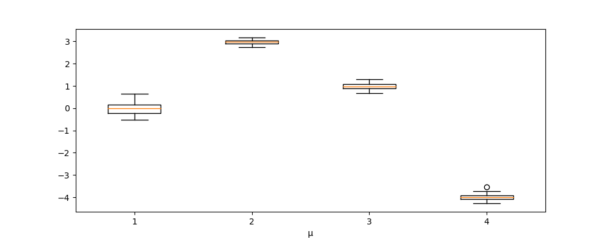
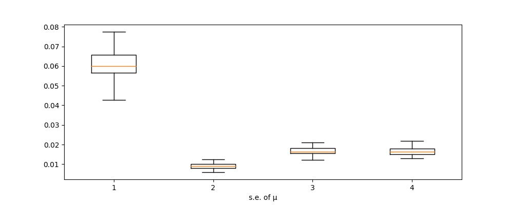

# Reproduce 11.2

### Preparation
$(Y_1,...,Y_K)$ have a K-variate normal distribution with mean $\mu=(\mu_1,...,\mu_K)$ and covariance matrix $\Sigma = (\sigma_{jk})$. $Y=(Y_{obs},Y_{mis})$ where Y represents a random sample of size n on $(Y_1,...,Y_K)$, $Y_{obs}$ is the observed values, and $Y_{mis}$ the missing data.

Let $Y_{obs} = (y_{obs,1},...,y_{obs,n})$, where y_{obs,i} represents the set of variables observed for case _i, i=1,...,n_.

### E-step
$
y_{ij}^{(t)} = \begin{cases}
y_{ij} &, if\ y_{ij}\ is\ observed\\
E[y_{ij},y_{obs,i},\theta^{(t)}] = \mu_{mis} + \Sigma_{mis-obs,i} \Sigma_{obs-obs,i}^{-1} (y_{obs,i}-\mu_{obs}) &, if\ y_{ij}\ is\ missing
\end{cases}
$

$
c_{jki}^{(t)} = \begin{cases}
0 &, if\ y_{ij}\ is\ observed\\
Cov(E_{ij},y_{obs,i},\theta^{(t)}) = \Sigma_{mis-mis,i} - \Sigma_{mis-obs,i} \Sigma_{obs-obs,i}^{-1} \Sigma_{obs-mis,i} &, if\ y_{ij}\ is\ missing
\end{cases}
$

where
$\Sigma_{mis-mis,i} = (\sigma_{jk})\ ,\ j,k\in\{h|y_{ih}\ is\ missing\}$
$\Sigma_{mis-obs,i} = (\sigma_{jk})\ ,\ j\in\{h|y_{ih}\ is\ missing\}\ ,\ k\in\{h|y_{ih}\ is\ observed\}$
$\Sigma_{obs-obs,i} = (\sigma_{jk})\ ,\ j,k\in\{h|y_{ih}\ is\ observed\}$

### M-step
$
\mu_j^{(t+1)} = n^{-1} \sum\limits_{i=1}^{n} y_{ij}^{(t)}\ \ ,\ \ \ \  j=1,...K
$

$
\sigma_{jk}^{(t+1)} = n^{-1} \sum\limits_{i=1}^{n} (y_{ij}^{(t)} - \mu_j^{(t+1)})(y_{ik}^{(t)} - \mu_k^{(t+1)}) + c_{jki}^{(t)}\ \ ,\ \ \ \ j,k=1,...,K
$

### Implement
Since there is no certain missing pattern, it would be easier to deal with the dataset case by case. In the former sessions, I usually rearrange the dataset to get separate covariance matrices, but it seems too inconvenient in this implement. So I decided to directly retrieve the covariance matrices from the whole covariance matrix $\Sigma$.

Here's my implement of EM algorithm:
```python
# y : the input dataset
# mu & sigma : the parameters
def EM(y,mu,sigma):
    r,c = y.shape
    if (mu.shape != (c,) or sigma.shape!=(c,c)):
        raise( NameError('the data and parameter not fit'))
    x = y.copy()
    Covmis = np.zeros([r,c,c])
    # E-step
    for i in range(r):
        # if ther is no missing in case i, then turn to case i+1
        if (np.all(np.isnan(x[i])==False)):continue;

        # store the index of missing values and observed values
        mis = np.where(np.isnan(x[i]))[0]
        obs = np.where(np.isnan(x[i])==False)[0]

        # retrive the covariance matrices (obs-obs , mis-mis , mis-obs)
        Smis = np.matrix(np.zeros([len(mis),len(mis)]))
        for j in range(len(mis)):
            for k in range(len(mis)):
                Smis[j,k] = sigma[mis[j],mis[k]]
        Sobs = np.matrix(np.zeros([len(obs),len(obs)]))
        for j in range(len(obs)):
            for k in range(len(obs)):
                Sobs[j,k] = sigma[obs[j],obs[k]]
        Smvo = np.matrix(np.zeros([len(mis),len(obs)]))
        for j in range(len(mis)):
            for k in range(len(obs)):
                Smvo[j,k] = sigma[mis[j],obs[k]]
        
        # calculate the Expectations
        x[i][mis] = mu[mis] +
                    np.array(Smvo*np.linalg.inv(Sobs)*
                             np.matrix(x[i][obs]-mu[obs]).transpose()
                             ).reshape(1,len(mis))
        tmp = Smis - Smvo*np.linalg.inv(Sobs)* Smvo.transpose()
        for j in range(len(mis)):
            for k in range(len(mis)):
                Covmis[i,mis[j],mis[k]] = tmp[j,k]

    # M-step
    re_mu = np.mean(x,axis=0)
    re_sigma = np.zeros([c,c])
    for j in range(c):
        for k in range(c):
            tmp = 0
            for i in range(r):
                tmp += (x[i,j]-re_mu[j])*(x[i,k]-re_mu[k]) + Covmis[i][j][k]
            re_sigma[j][k] = tmp/r
    return re_mu,re_sigma
```

### Simulation

I randomly generated 3 _C_-variate normal distribution parameters $(\mu,\Sigma)$ and 3 random samples of size _R_ that has the distrubution $N(\mu,\Sigma)$, the generated dataset stores in _ORIGIN_Y_

```python
np.random.seed(0)   # set it to 0 , 1 , 2 to get 3 different MU and SIGMA
R = 200 # sample size
C = 4   # number of random variables

# generate random mean MU and covariance matrix SIGMA
MU = np.random.randint(-4,4,size=C)

# generate a positive semidefinite matrix as covariance matrix
A = np.matrix(np.random.normal(0,1,size=[C,C]))
SIGMA = A*A.transpose()

# generate multivariate normal sample
ORIGIN_Y = np.random.multivariate_normal(MU,SIGMA,size=R)
```
Copy _ORIGIN_Y_ into _Y_ and randomly remove some values in Y at a certain missing rate.
```python
# randomly remove some obsevations
missing_rate = 0.4
MISS = np.random.binomial(1,missing_rate,size=[R,C])
# minor fix for those entirely deleted obsevations so that evary case has observations
for i in range(100):
    if (np.all(MISS[i] == 1)):
        MISS[i,np.random.randint(0,C)] = 0
Y = ORIGIN_Y.copy()
Y[np.where(MISS==1)] = np.nan
```
Then, use complete cases to acquire starting point and run EM algorithm till convergence.

### Results
| Random seed        | 0                       | 1                        | 2                       |
|--------------------|-------------------------|--------------------------|-------------------------|
| Real $\mu$         | (0.00,3.00,1.00,-4.00)  | (1.00,-1.00,0.00,-4.00)  | (-4.00,3.00,1.00,-4.00) |
| MLE $\mu$ (full Y) | (0.21,3.06,1.23,-3.97)  | (1.32,-0.95,-0.01,-3.92) | (-3.98,3.20,0.79,-4.03) |
| CC MLE $\mu$ (Y)   | (0.33,3.24,1.19,-3.81)  | (2.48,-1.24,-0.32,-3.89) | (-2.87,2.98,0.60,-4.24) |
| EM MLE $\mu$ (Y)   | (-0.03,3.07,1.20,-3.92) | (1.20,-1.07,-0.01,-3.85) | (-3.80,3.19,0.68,-4.03) |
| Standard error(EM) | (0.25,0.09,0.13,0.13)   | (0.21,0.15,0.20,0.14)    | (0.28,0.18,0.22,0.12)   |


MLEs of $\mu$ and $\Sigma$ that acquired by EM algorithm is much better than Complete-Case analysis, moreover, it is close to the MLEs calculated using the full generaterd data. The EM algorithm perform well in this circumstance.

$\ \ \ \ \ \ \ \ \ \ \ \ \ \ \ \ \ \ \ \ \ \ \ \ \ \ \ \ \ \ \ \ \ seed=0 \ \ \ \ \ \ \ \ \ \ \ \ \ \ \ \ \ \ \ \ \ \ \ \ \ \ \ \ \ \ \ \ \ \ \ \ \ \ \ \ \ seed=1 \ \ \ \ \ \ \ \ \ \ \ \ \ \ \ \ \ \ \ \ \ \ \ \ \ \ \ \ \ \ \ \ \ \ \ \ \ \ \ \ \ \ seed=2$
$Cov_{real}
\begin{bmatrix}
10.42&-0.00&4.70&4.17\\-0.00&1.10&-0.11&0.13\\4.70&-0.11&2.73&1.66\\4.17&0.13&1.66&2.58
\end{bmatrix}\ \ \ 
\begin{bmatrix}
7.48&0.75&2.04&2.45\\0.75&3.79&4.11&2.98\\2.04&4.11&6.63&4.32\\2.45&2.98&4.32&3.30
\end{bmatrix}\ \ \ 
\begin{bmatrix}
11.18&-0.45&3.45&-3.08\\-0.45&3.75&-1.60&-0.03\\3.45&-1.60&6.81&-2.38\\-3.08&-0.03&-2.38&2.03
\end{bmatrix}
$

$Cov_{full}
\begin{bmatrix}
9.55&-0.12&4.22&3.74\\-0.12&0.92&-0.18&0.13\\4.22&-0.18&2.53&1.33\\3.74&0.13&1.33&2.53
\end{bmatrix}\ \ \ 
\begin{bmatrix}
6.57&0.49&1.67&2.06\\0.49&3.53&4.04&2.79\\1.67&4.04&6.97&4.47\\2.06&2.79&4.47&3.26
\end{bmatrix}\ \ \ 
\begin{bmatrix}
9.95&-0.78&3.14&-2.63\\-0.78&4.42&-1.82&0.08\\3.14&-1.82&6.97&-2.48\\-2.63&0.08&-2.48&1.97
\end{bmatrix}
$

$Cov_{CC}\ 
\begin{bmatrix}
8.28&-0.42&3.69&3.10\\-0.42&1.00&-0.43&0.13\\3.69&-0.43&2.50&1.05\\3.10&0.13&1.05&2.31
\end{bmatrix}\begin{bmatrix}
4.39&-0.83&0.14&1.03\\-0.83&4.15&4.71&2.97\\0.14&4.71&7.07&4.49\\1.03&2.97&4.49&3.16
\end{bmatrix}
\begin{bmatrix}
11.36&-0.93&2.61&-2.61\\-0.93&4.07&-3.15&0.54\\2.61&-3.15&10.30&-3.74\\-2.61&0.54&-3.74&2.46
\end{bmatrix}
$

$Cov_{EM}
\begin{bmatrix}
9.90&-0.31&4.05&3.50\\-0.31&0.94&-0.35&0.22\\4.05&-0.35&2.46&1.13\\3.50&0.22&1.13&2.43
\end{bmatrix}\ \ \ 
\begin{bmatrix}
6.47&0.39&1.69&2.13\\0.39&3.14&3.53&2.57\\1.69&3.53&6.80&4.61\\2.13&2.57&4.61&3.53
\end{bmatrix}\ \ \ 
\begin{bmatrix}
10.34&-0.77&2.72&-2.64\\-0.77&4.18&-1.86&-0.15\\2.72&-1.86&7.35&-2.64\\-2.64&-0.15&-2.64&2.10
\end{bmatrix}
$

s.e. of ${EM}
\begin{bmatrix}
1.17&0.32&0.53&0.51\\0.32&0.12&0.17&0.17\\0.53&0.17&0.31&0.25\\0.51&0.17&0.25&0.31
\end{bmatrix}\ \ \ \ \ \ \ \ 
\begin{bmatrix}
0.79&0.44&0.62&0.45\\0.44&0.39&0.47&0.34\\0.62&0.47&0.78&0.52\\0.45&0.34&0.52&0.40
\end{bmatrix}\ \ \ \ \ \ \ \ \ 
\begin{bmatrix}
1.33&0.73&0.91&0.49\\0.73&0.54&0.57&0.30\\0.91&0.57&0.90&0.40\\0.49&0.30&0.40&0.25
\end{bmatrix}
$

### Repeated simulation

I set random seed to 0 and generated 100 datasets. EM algorithm is applied to each dataset. Here is the result of $\mu$.

