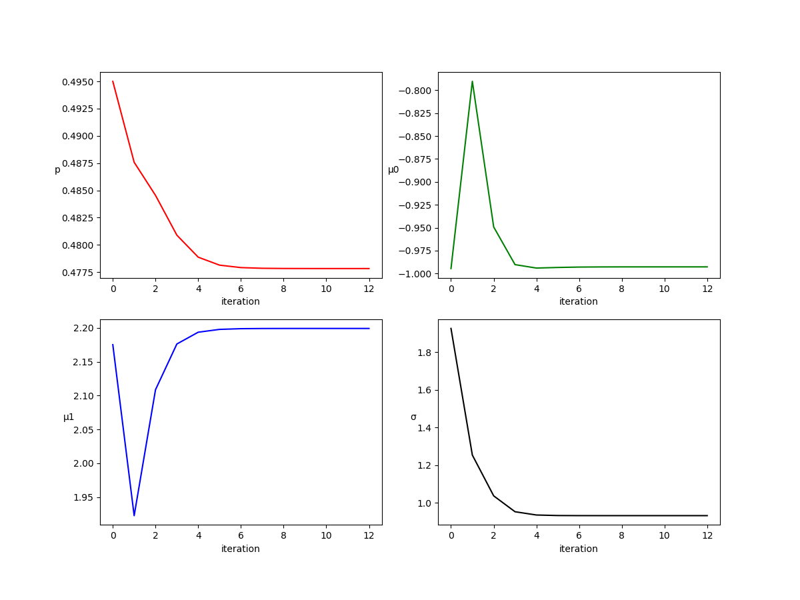

# Problem 8.16 extended

### EM simluation

```python
import numpy as np
import matplotlib.pyplot as plt

np.random.seed(10)

# actual values
_p = 0.5
_mu0 = -1
_mu1 = 2
_sigma = 1

# randomly generate data
n = 200
r = np.random.binomial(200,0.5)
X = np.random.binomial(1,_p,size=n)
Y = np.zeros(n)
Y[np.where(X==0)] = np.random.normal(loc=_mu0,scale=_sigma,size=Y[np.where(X==0)].size)
Y[np.where(X==1)] = np.random.normal(loc=_mu1,scale=_sigma,size=Y[np.where(X==1)].size)
```
$x_i$ is randomly generated and each $y_i$ is generaterd according to $x_i$. Simplily removing the last n-r values of X yields a MCAR parttern.

```python
# EM's control parameters
cache_size = 1000 # record the last $cache_size$ iteration's results
delta = np.inf    # difference between (p,mu0,mu1,sigma)[t] and (p,mu0,mu1,sigma)[t+1]
c_limit = 1e-6    # stop iteration if delta < $c_limit$
```
Define the control parameters to be used in EM algorithm.

```python
# f(y|x=1;p,mu0,mu1,sigma)
def f(y,loc,scale):
    return np.exp(-(y-loc)**2/(2*scale**2))/(np.sqrt(2*np.pi)*scale)
```
Define a function to calculate the density of Gaussian distribution

```python
w = np.zeros(n)
w[0:r] = X[0:r]
p = np.zeros(cache_size)
mu0 = np.zeros(cache_size)
mu1 = np.zeros(cache_size)
sigma = np.zeros(cache_size)
t = 0
p[0] = np.mean(X)
mu0[0] = np.mean(Y[np.intersect1d(np.where(X==0),range(r))])
mu1[0] = np.mean(Y[np.intersect1d(np.where(X==1),range(r))])
sigma[0] = np.sqrt(np.mean(Y[0:r]*Y[0:r]))
```
Initialize the variables. Use the available cases to get initial value of $(p,\mu_0,\mu_1,\sigma)$

```python
while (delta > c_limit and t<cache_size):
    # E-step
    w[r:n] = (f(Y[r:n],mu1[t],sigma[t])*p[t]) / (f(Y[r:n],mu1[t],sigma[t])*p[t] + f(Y[r:n],mu0[t],sigma[t])*(1-p[t]))
    # M-step
    p[t+1] = np.mean(w)
    mu0[t+1] = sum((1-w)*Y) / sum(1-w)
    mu1[t+1] = sum(w*Y) / sum(w)
    sigma[t+1] = np.sqrt((sum((1-w)*(Y-mu0[t+1])**2) + sum(w*(Y-mu1[t+1])**2))/n)
    delta = max([p[t+1]-p[t],mu0[t+1]-mu0[t],mu1[t+1]-mu1[t],sigma[t+1]-sigma[t]])
    t += 1
```

### Results
| iteration | p          | $\mu_0$     | $\mu_1$    | $\sigma$   |
|-----------|------------|-------------|------------|------------|
| 0         | 0.49500000 | -0.99457691 | 2.17524187 | 1.92607354 |
| 1         | 0.48758075 | -0.79025558 | 1.92259111 | 1.25311736 |
| 2         | 0.48454403 | -0.94919517 | 2.10867222 | 1.03616975 |
| 3         | 0.48089607 | -0.99030215 | 2.17624148 | 0.95182042 |
| 4         | 0.47887747 | -0.99403613 | 2.19365271 | 0.93447625 |
| 5         | 0.47814558 | -0.99338580 | 2.19782225 | 0.93164587 |
| 6         | 0.47792149 | -0.99295901 | 2.19885236 | 0.93118387 |
| 7         | 0.47785747 | -0.99280857 | 2.19911555 | 0.93110293 |
| 8         | 0.47783976 | -0.99276315 | 2.19918427 | 0.93108730 |
| 9         | 0.47783493 | -0.99275025 | 2.19920243 | 0.93108396 |
| 10        | 0.47783362 | -0.99274669 | 2.19920727 | 0.93108318 |
| 11        | 0.47783327 | -0.99274572 | 2.19920856 | 0.93108299 |
| 12        | 0.47783318 | -0.99274546 | 2.19920890 | 0.93108294 |




---------------------------------------------------------
### Previously

$X$ is Bernoulli with $Pr(X=1)=1-Pr(X=0)=p$. $Y$ given $X=j$ is normal with mean $\mu_j$ and variance $\sigma^2$.

Consider now the monotone missing-data pattern with Y completely observed but n-r values of X missing and an ignorable mechanism.

Describe the E and M steps of EM algorithm for this problem.

### preparation
Let $\theta = (p,\mu_0,\mu_1,\sigma)$ , we have
$$
\large
\begin{array}{ccc}
f(y_i|x_i=j;\theta) = \frac{1}{\sqrt{2\pi}\sigma}
exp\left[-\frac{(y_i-\mu_j)^2}{2\sigma_2}\right]\\
\\
f(x_i=1|\theta)=1-f(x_i=0|\theta)=p
\end{array}
$$

### E-step
$
\large
w_i=E[X_i|x,y,\theta^{(t)}] = \begin{cases}
x_i &, i\leq r\\
\frac{f(y_i|x_i=1;\theta^{(t)})f(x_i=1;\theta^{(t)})}{f(y_i|x_i=0;\theta^{(t)})f(x_i=0;\theta^{(t)})+f(y_i|x_i=1;\theta^{(t)})f(x_i=1;\theta^{(t)})} &, i>r
\end{cases}
$

### M-step
$
\large
\begin{array}{ccccccc}
p^{(t+1)}&=&\sum\limits_{i=1}^{n}{w_i} / n\\
\\
\mu_0^{(t+1)}&=&\sum\limits_{i=1}^{n}{(1-w_i)y_i} / {\sum\limits_{i=1}^{n}{(1-w_i)}}\\
\\
\mu_1^{(t+1)}&=&\sum\limits_{i=1}^{n}{w_iy_i} / {\sum\limits_{i=1}^{n}{w_i}}\\
\\
\sigma^{(t+1)}&=&\sqrt{\sum\limits_{i=0}^{n}[(1-w_i)(y_i-\mu_0^{(t+1)})^2 + w_i(y_i-\mu_1^{(t+1)})^2]/{n}}
\end{array}
$

